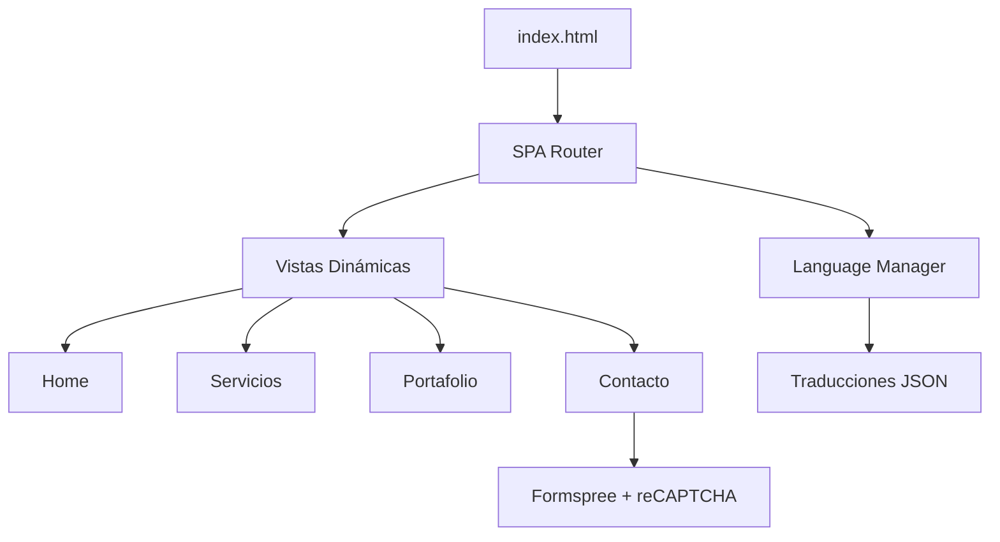

# QA Professional Portfolio
 

Una SPA (Single Page Application) moderna que muestra mis servicios y experiencia como profesional de Control de Calidad (QA), con arquitectura escalable y diseño atómico.

## 🌟 Características Principales

* SPA con navegación sin recargas
* Soporte para 2 idiomas (español/inglés)
* Formulario seguro con reCAPTCHA
* Diseño responsive

## 🏗️ Arquitectura del Proyecto

## **🚀 Stack Tecnológico**  

### **🌐 Frontend**  
| Tecnología       | Uso en el Proyecto                          | Versión |  
|------------------|---------------------------------------------|---------|  
|  | Estructura semántica y vistas SPA.          | 5       |  
|  | Estilos modulares con diseño atómico.       | 3       |  
|  | Lógica SPA, formularios y animaciones.      | ES6+    |  

### **🔌 Integraciones**  
| Servicio         | Función                                     | Versión/Plan |  
|------------------|---------------------------------------------|--------------|  
|  | Procesamiento de formularios y envío a Gmail. | Free Tier    |  
|  | Protección contra spam en formularios.       | v2           |  
|  | Componentes responsive y utilidades CSS.     | 5.3.x        |  

## Licencia

ISC License

Copyright (c) 2025 George Castrejón

Se concede permiso para usar, copiar, modificar y/o distribuir este software para cualquier propósito con o sin tarifa, siempre que el aviso de copyright anterior y este aviso de permiso aparezcan en todas las copias.

